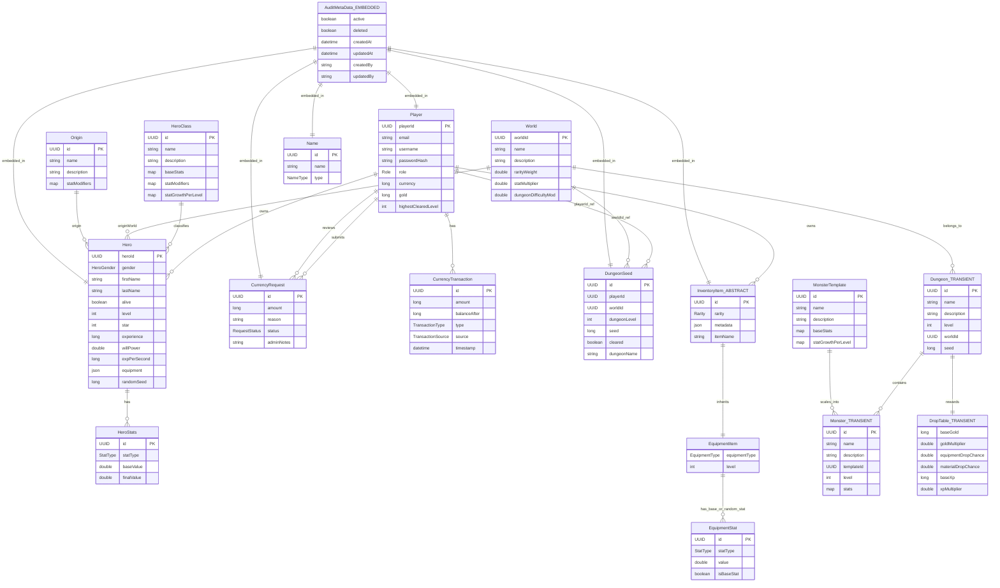

# LokiGame Entity Relationship Diagram

This Mermaid ER diagram covers the domain models under `src/main/java/com/theliems/lokigame/model/entity`, including:

- persisted JPA entities
- transient runtime-only domain entities
- the abstract parent-child inheritance chain
- the embedded audit value object reused across entities

